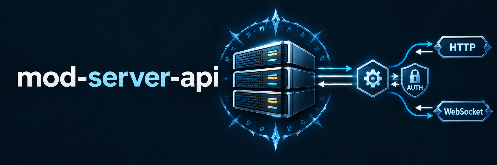

# mod-server-api

`mod-server-api` adds an HTTP web server to AzerothCore's `worldserver` and
provides a shared foundation for API integrations from third-party modules.
An integration registers its own handlers under
`/api/v1/mod/<module-name>/...`; clients use the common HTTP server, routing,
authentication and request limits, while the integration module retains
ownership of its domain logic and data. `GET /api/v1/modules` lists the
registered module capabilities.



Built-in endpoints cover health and readiness, server state and metrics,
online players, the database-backed character catalog, groups, and active
dungeon/raid instances. The module also provides a world-thread runtime
snapshot, a bounded in-process EventBus, and `/ws/v1/events` with subscriptions
and ping/pong. Authentication is selected through a provider registry and
defaults to `NoAuthProvider` on localhost; see [docs/auth.md](docs/auth.md).

## Installation

Place or clone this repository as `modules/mod-server-api` in the
AzerothCore source tree, then reconfigure and rebuild the core:

```bash
cmake -S . -B build
cmake --build build --target worldserver --parallel
```

The core CMake configuration automatically installs
`conf/mod-server-api.conf.dist` with the other module configuration files.
Copy it to the active configuration directory if needed and edit the
`ServerApi.*` options before starting `worldserver`.

## Requirements

- AzerothCore WotLK source tree.
- `mod-playerbots` is optional. Without it, the core HTTP API still builds;
  bot-specific account types are reported as `unknown`.

## License

This project is licensed under the [GNU Affero General Public License v3.0 only](LICENSE).

## Supported API

Default address:

```text
http://127.0.0.1:7878
```

The listener is enabled by default on localhost with
`ServerApi.Auth.Provider = "none"`. The configured provider handles versioned
HTTP endpoints and WebSocket handshakes; `/health` and `/ready` stay public.

### Health

These endpoints are public and intended for liveness/readiness probes.

| Method | Endpoint | Response |
|---|---|---|
| `GET` | `/health` | `{"status":"ok"}` |
| `GET` | `/ready` | `{"status":"ready"}` |

### Server

| Method | Endpoint | Auth |
|---|---|---|
| `GET` | `/api/v1/server` | configured provider |
| `GET` | `/api/v1/server/metrics` | configured provider |

`/api/v1/server` returns `realmId`, `serverTime`, `uptimeSeconds`,
`playersOnline` and `botsOnline`.

`/api/v1/server/metrics` returns `activeMaps`, `activeInstances`,
`playersOnline`, `botsOnline`, `eventQueue`, `commandQueue` and
`droppedEvents`.

Example:

```bash
curl \
  http://127.0.0.1:7878/api/v1/server

curl \
  http://127.0.0.1:7878/api/v1/server/metrics
```

### Players

`/api/v1/players` remains the online runtime snapshot. It is separate from the
database-backed all-character catalog documented below.

| Method | Endpoint | Auth |
|---|---|---|
| `GET` | `/api/v1/players` | configured provider |
| `GET` | `/api/v1/players/{guid}` | configured provider |

Supported list query parameters:

| Parameter | Description |
|---|---|
| `name` | Case-sensitive substring filter |
| `mapId` | Exact map ID filter |
| `limit` | Maximum number of records, capped at 1000; default 100 |

Example:

```bash
curl \
  'http://127.0.0.1:7878/api/v1/players?limit=10&mapId=0'

curl \
  http://127.0.0.1:7878/api/v1/players/123
```

The list response has the following shape:

```json
{
  "data": [
    {
      "guid": 123,
      "name": "Papas",
      "level": 60,
      "class": 1,
      "race": 2,
      "mapId": 0,
      "zoneId": 12,
      "online": true
    }
  ]
}
```

The detail response additionally contains `health`, `power` and `position`.
`power` uses the player's active class power type (mana, rage, energy or runic
power).

### Characters

The character API is read-only and reads the current realm's Character DB.
It includes online and offline characters. Deleted rows are hidden by default;
`includeDeleted=true` includes soft-deleted rows in list results. Character
details always hide deleted rows and return `404` for a deleted or missing GUID.

| Method | Endpoint | Auth |
|---|---|---|
| `GET` | `/api/v1/characters` | configured provider |
| `GET` | `/api/v1/characters/{guid}` | configured provider |

List parameters:

| Parameter | Description |
|---|---|
| `limit` | Page size, default 100, maximum 1000 |
| `cursor` | Exclusive GUID cursor from the prior response's `nextCursor` |
| `name` | Case-insensitive name prefix |
| `accountId`, `guildId`, `race`, `class`, `mapId`, `zoneId` | Exact match |
| `online`, `bot`, `includeDeleted` | Boolean (`true`/`false` or `1`/`0`) |
| `botType` | `player`, `random`, `addclass` or `unknown` |
| `minLevel`, `maxLevel` | Inclusive level bounds |

Filters are combined with `AND`. Unknown or repeated parameters, invalid values,
and `minLevel > maxLevel` return `400 INVALID_FILTER`. The cursor is an
exclusive GUID: keep the same filters and pass the previous `nextCursor` to
continue. A response has this shape:

```json
{
  "data": [{"guid": 123, "name": "Papas", "online": true}],
  "hasMore": true,
  "nextCursor": 123
}
```

Results are ordered by ascending GUID and return `data`, `hasMore` and
`nextCursor`; the API does not calculate a total count. Dynamic filters use the
current immutable online snapshot. If a selective filter needs to scan more
than 10,000 database candidates, a page can contain fewer than `limit` rows;
continue with `nextCursor` while `hasMore` is true. Concurrent catalog/profile
requests are capped at 32 and excess requests receive `503`.

Each list entry includes `guid`, `accountId`, `name`, `race`, `class`, `gender`,
`level`, `guildId`, `guildName`, `online`, `bot`, `botType`, `deleted`,
`mapId`, `zoneId` and `location` (`mapId`, `zoneId`, `x`, `y`, `z` and
`orientation`). A profile adds `xp`, `money`, `talents` (`activeGroup` and
`totalGroups`), `equipment` entries (`slot` and `itemEntry`) and `professions`
(`skillId`, `name`, `value` and `max`).

Online status, map, zone and coordinates are taken from the current runtime
snapshot for online characters. Other character fields are read from DB and
may reflect the last saved state. Bot sessions are detected from the runtime
snapshot; `random` and `addclass` types come from Playerbots account assignments.
Without Playerbots or its account-type table, `botType` is `unknown`. A
Playerbots bot on an ordinary player account can therefore have `bot=true` and
`botType=player` while online; offline bot status is inferred only from
Playerbots account type.

The profile includes core identity/level fields, account ID, guild, effective
location, equipped items in equipment slots, active talent group, and profession
skill values. Bags, bank, mail and account credentials are not exposed.

Examples:

```bash
curl \
  'http://127.0.0.1:7878/api/v1/characters?limit=100&name=pap&online=false&minLevel=20'

curl \
  'http://127.0.0.1:7878/api/v1/characters?limit=100&name=pap&cursor=123'

curl \
  'http://127.0.0.1:7878/api/v1/characters/123'
```

Character endpoint errors use `400 INVALID_FILTER` or `INVALID_GUID` for bad
input, `404 CHARACTER_NOT_FOUND` for a missing or deleted profile, and
`503 DATABASE_UNAVAILABLE` or `CHARACTER_QUEUE_FULL` when the database or
bounded request capacity is unavailable.

### Modules

`GET /api/v1/modules` returns the API capabilities registered by the running
worldserver modules. The endpoint is intentionally metadata-only: feature
modules own their domain state and rules, while `mod-server-api` provides the
transport, authentication, snapshots, commands and events used to expose them.

Each item contains `name`, `version` and a list of capability names.

### Groups

| Method | Endpoint | Auth |
|---|---|---|
| `GET` | `/api/v1/groups` | configured provider |
| `GET` | `/api/v1/groups/{id}` | configured provider |

Groups are collected from online players on the world thread. A group with no
online player is not visible in this runtime snapshot. Each item contains
`id`, `leaderGuid`, `raid` and the `members` array of character GUIDs.

### Instances

| Method | Endpoint | Auth |
|---|---|---|
| `GET` | `/api/v1/instances` | configured provider |
| `GET` | `/api/v1/instances/{instanceId}` | configured provider |

The response contains active dungeon and raid maps only. Each item contains
`instanceId`, `mapId`, `difficulty` and the current non-GM `players` count.
Persistent instance-save state and a `startedAt` timestamp are not exposed.

### Bots

| Method | Endpoint | Auth |
|---|---|---|
| `GET` | `/api/v1/bots` | configured provider |

When `mod-playerbots` is compiled into the worldserver, the endpoint returns
online bot players with the same basic fields as the player list. Without
`mod-playerbots`, it returns `501 NOT_SUPPORTED`; the server API module still
builds normally. Bot-specific invite/kick commands remain deferred until the
playerbots integration is connected to the command queue.

### Commands

`POST /api/v1/players/{guid}/kick` queues a player kick for execution on the
world thread. It does not run game-object operations from the HTTP worker.
The normal response is `202 Accepted`:

```bash
curl -i -X POST \
  http://127.0.0.1:7878/api/v1/players/123/kick
```

The command queue is bounded and receives at most 2 ms of execution time per
world update. If it is full, the API returns `503 COMMAND_QUEUE_FULL`. This
command is intentionally not included in the automatic contract test because
it changes server state and can disconnect a real player.

`POST /api/v1/players/{guid}/teleport` uses the same queue and requires
`mapId`, `x`, `y`, `z` and `orientation` query parameters:

```bash
curl -i -X POST \
  'http://127.0.0.1:7878/api/v1/players/123/teleport?mapId=0&x=-8949.95&y=-132.49&z=83.53&orientation=0'
```

### WebSocket events

Endpoint:

```text
ws://127.0.0.1:7878/ws/v1/events
```

The WebSocket handshake uses the configured authentication provider. After
connecting, send a compact JSON subscription message:

```json
{"type":"subscribe","events":["server.*","player.*","group.*","instance.*"]}
```

Supported client messages:

```json
{"type":"subscribe","events":["player.*"]}
{"type":"unsubscribe"}
{"type":"ping"}
```

The server responds with `subscribed`, `unsubscribed` or `pong`. Event messages
use this envelope:

```json
{
  "type": "player.login",
  "timestamp": 1788753200123,
  "version": 1,
  "data": {
    "guid": "123",
    "name": "Papas",
    "level": "60",
    "mapId": "0",
    "zoneId": "12"
  }
}
```

Currently published events:

| Event | Source |
|---|---|
| `server.started` | `ServerApiWorldScript::OnStartup` |
| `server.stopping` | `ServerApiWorldScript::OnShutdown` |
| `player.login` | `PlayerScript::OnPlayerLogin` |
| `player.logout` | `PlayerScript::OnPlayerLogout` |
| `player.death` | `PlayerScript::OnPlayerJustDied` |
| `player.position` | Player map or position changes in the world snapshot |
| `combat.snapshot` | Sampled active-combat state for one player |
| `group.created` | Group appears in the online-player snapshot |
| `group.updated` | Group leader, raid flag or member list changes |
| `group.disbanded` | Group leaves the online-player snapshot |
| `instance.started` | Dungeon/raid instance appears in the snapshot |
| `instance.updated` | Instance difficulty or non-GM player count changes |
| `instance.stopped` | Dungeon/raid instance leaves the snapshot |

Subscriptions use exact event names or a trailing wildcard such as `player.*`.
Each WebSocket has a bounded outgoing queue; an overflowing connection is
closed to protect the API worker.
The total number of WebSocket clients is limited by
`ServerApi.WebSocket.MaxClients` (default 50).

Position sampling uses `ServerApi.PositionUpdates.IntervalMs` (default 1000 ms)
and is performed from the world-thread snapshot. The module does not emit one
event per movement packet.

Combat snapshots use `ServerApi.CombatSnapshot.IntervalMs` (default 2000 ms)
and include `guid`, `mapId`, `victimGuid`, `health`, `maxHealth`, `power` and
`maxPower` in the event data. Damage, healing and threat counters are not
included yet; collecting them requires a dedicated low-overhead combat
aggregator.

### HTTP errors

| Status | Meaning |
|---:|---|
| `400` | Invalid request or command parameters |
| `401` | Configured authentication provider rejected the request |
| `404` | Unknown endpoint or character/player not found |
| `405` | Known endpoint called with an unsupported method |
| `413` | Request exceeds `ServerApi.MaxRequestBytes` |
| `429` | Global HTTP request rate limit exceeded |
| `500` | Authentication provider failed or returned an invalid result |
| `501` | Optional integration is unavailable |
| `503` | Character database/request capacity, command queue or WebSocket client limit reached |

### cURL examples

Проверка доступности API без авторизации:

```bash
curl -i http://127.0.0.1:7878/health
curl -i http://127.0.0.1:7878/ready
```

Проверка API с провайдером `none` по умолчанию:

```bash
curl -i http://127.0.0.1:7878/api/v1/server
curl -i http://127.0.0.1:7878/api/v1/players
```

Примеры запросов:

```bash
curl -i \
  http://127.0.0.1:7878/api/v1/server

curl -i \
  http://127.0.0.1:7878/api/v1/server/metrics

curl -i \
  'http://127.0.0.1:7878/api/v1/players?limit=10'

curl -i \
  'http://127.0.0.1:7878/api/v1/players?name=Papas&mapId=0&limit=25'

curl -i \
  http://127.0.0.1:7878/api/v1/players/123

curl -i \
  http://127.0.0.1:7878/api/v1/groups

curl -i \
  http://127.0.0.1:7878/api/v1/groups/123

curl -i \
  http://127.0.0.1:7878/api/v1/instances

curl -i \
  http://127.0.0.1:7878/api/v1/instances/1

curl -i \
  http://127.0.0.1:7878/api/v1/bots
```

Проверка ошибок фильтров и неизвестного игрока:

```bash
curl -i \
  'http://127.0.0.1:7878/api/v1/players?mapId=invalid'

curl -i \
  'http://127.0.0.1:7878/api/v1/players?limit=0'

curl -i \
  http://127.0.0.1:7878/api/v1/players/999999999

curl -i \
  http://127.0.0.1:7878/api/v1/groups/not-a-number

curl -i \
  http://127.0.0.1:7878/api/v1/instances/999999999
```

## Configuration

```ini
ServerApi.Enable = 1
ServerApi.BindAddress = "127.0.0.1"
ServerApi.Port = 7878
ServerApi.MaxRequestBytes = 1048576
ServerApi.MaxRequestsPerSecond = 1000
ServerApi.PositionUpdates.IntervalMs = 1000
ServerApi.CombatSnapshot.IntervalMs = 2000
ServerApi.WebSocket.Enable = 1
ServerApi.WebSocket.MaxFrameBytes = 1048576
ServerApi.WebSocket.MaxSubscriptions = 100
ServerApi.WebSocket.MaxQueue = 100
ServerApi.WebSocket.MaxClients = 50
ServerApi.Auth.Provider = "none"
```

To use a custom provider:

```ini
ServerApi.Auth.Provider = "my-provider"
```

The provider must be registered by a compiled AzerothCore module before the API
starts. Unknown provider names stop the listener. Non-local binds require a
provider whose `RequiresAuthentication()` returns `true`; `none` is only
allowed on loopback. The module does not provide TLS, so remote access should
use a trusted TLS-terminating proxy or protected tunnel. Provider integration
details are in [docs/auth.md](docs/auth.md). The former
`ServerApi.Auth.Enable` and `ServerApi.Auth.ApiKey` settings are no longer read.

On startup, the module logs the selected provider name, listener, limits and
sampling intervals. Provider secrets are not included in the startup summary.

## Testing

The REST contract is also available as [docs/openapi.yaml](docs/openapi.yaml).

Build and run the automatic module unit tests:

```bash
cmake -S /path/to/azerothcore-wotlk -B /path/to/azerothcore-wotlk/build \
  -DBUILD_TESTING=ON
cmake --build /path/to/azerothcore-wotlk/build --target server_api_tests --parallel
ctest --test-dir /path/to/azerothcore-wotlk/build \
  -R server_api_tests --output-on-failure
```

Run API contract tests against a running worldserver:

```bash
./tests/test_api_contract.sh
```

For labelled manual curl checks, run:

```bash
./tests/api-curl-checks.sh
```

Run the WebSocket protocol smoke test with Node.js 22+:

```bash
node ./tests/test-websocket.js
```

The test validates the handshake, `subscribe`, `ping/pong` and JSON event
envelopes when a telemetry event is produced during the timeout.

Run a read-only REST load smoke test:

```bash
./tests/load-api.sh
```

Defaults are 100 requests with concurrency 10. Override them with
`SERVER_API_REQUESTS`, `SERVER_API_CONCURRENCY` and
`SERVER_API_LOAD_ENDPOINT`.

Run a WebSocket load smoke test:

```bash
SERVER_API_WS_CLIENTS=10 \
SERVER_API_WS_DURATION_MS=5000 \
node ./tests/load-websocket.js
```

The client count must not exceed `ServerApi.WebSocket.MaxClients`.

After rebuilding with the client limit enabled, verify rejection above the
limit:

```bash
SERVER_API_WS_LIMIT_TEST_CLIENTS=51 \
node ./tests/test-websocket-limit.js
```

The test passes when at least one connection is rejected with the configured
`503 WS_CLIENT_LIMIT` behavior.

## AzerothCore integration

- Configuration: `conf/mod-server-api.conf.dist`, installed automatically by
  the core CMake configuration.
- SQL patches: none. The character catalog reads existing Character DB tables;
  it does not modify the schema.
- CMake hooks: none. `mod-server-api.cmake` adds the unit-test target when
  `BUILD_TESTING` is enabled.
- Core hooks: `WorldScript::OnBeforeConfigLoad`, `OnStartup`, `OnUpdate` and
  `OnShutdown`; `PlayerScript::OnPlayerLogin`, `OnPlayerLogout` and
  `OnPlayerJustDied`.

## Development

The module follows the official [AzerothCore skeleton-module](https://github.com/azerothcore/skeleton-module)
layout. Build the core with precompiled headers disabled while developing the module:

```bash
cmake -S /path/to/azerothcore-wotlk -B /path/to/azerothcore-wotlk/build -DNOPCH=1
cmake --build /path/to/azerothcore-wotlk/build --target worldserver
```

Read the [integration guide](docs/integration.md) and
[architecture notes](docs/architecture.md) before implementing features.
